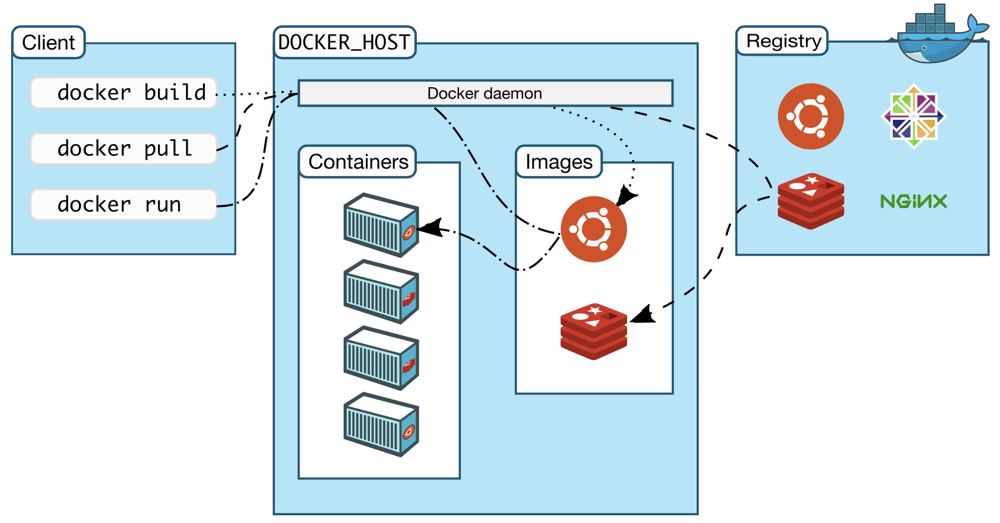

# Docker介绍

举个栗子：jdk8，jdk9的服务直接部署在机器上，机器的环境变量是设置jdk8呢还是jdk9呢？各个应用之间端口如何分配更合理呢。
但是如果使用了容器化部署，应用和依赖一起打包，采用容器隔离资源，各种环境只适用在容器内部，互不干涉。岂不美哉？

## Docker是什么

Docker是一个开源的应用`容器`引擎。使用沙箱机制，能让开发者将应用及其依赖打包在一起，搞成一个`镜像`然后以容器的方式运行。
这个容器非常轻量而且可移植，开源运行在任何流行Linux的机器上。容器与容器之间没有任何接口，通过内部网络的方式进行交互。
我们可以通过去`镜像仓库`下载镜像运行在Docker引擎之上。

>镜像：就如同装系统的时候那个系统镜像一个概念，比如win10（或许还带点儿360全家桶），把操作系统制作好然后打成一个镜像供用户下载。 
>容器：当这个镜像运行起来当时候，就形成了一个应用容器。当中运行的就是我们的应用程序，比如win10操作系统运行时候，或许还运行个360全家桶。 
>镜像仓库：就相当于一个镜像管理站点，比如win10操作系统可以去微软官方下载，当然这个仓库也是面对社会用户的，允许上传用户自己的镜像，和maven仓库一个概念。

如上理解，只要这个操作系统镜像一样，而且机器支持安装这个操作系统，那么各个机器运行这个镜像的时候，其中带东西都一样，
有360运行在哪里都有360，除非把360删掉再重新制作一个操作系统镜像。

## 如何实现隔离

容器和容器之间要实现资源隔离，就不得不提出一个概念。LXC（Linux Container），即Linux容器。

在Linux内核中，提供了cgroup（controll group）和namespace的功能来实现资源的隔离，这些资源包括进程、网络、用户ID、文件系统。

> 官方文档解释：docker用namespace来提供workspace的隔离，即容器。docker将为容器创建一组namespace。
> docker使用cgroup来控制和限制容器所需的资源。cgroup允许docker引擎在各个容器之间共享硬件资源，并可以限制容器使用的资源。

如上，可以对容器对资源进行限制，可以实现一个资源对最大利用，举个例子，可以将CPU型任务和IO任务部署在一起实现资源最大化利用而节约钱。

// todo
