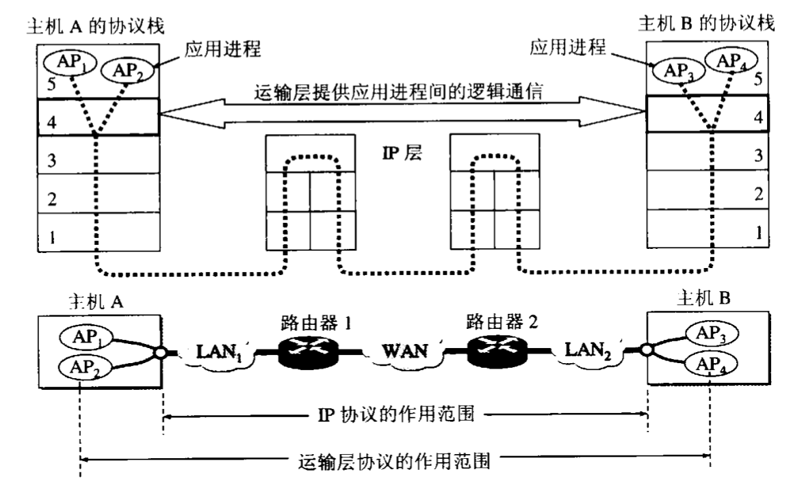

# 运输层
运输层是整个网络层次中的关键层次之一，向上为应用层提供服务，同时也是用户功能的最底层。
在端到端通信时，只有主机协议栈中存在，转发分组的路由器中不存在此协议。
运输层传输数据的基本单位称作TPDU（运输协议数据单元）。
传输层服务于应用进程之间的通信，而IP层服务于主机之间的通信，作用范围如下图。

## 提供的服务
1. 在端到端通信的过程中，是两端的主机在通信，更确切地说是两端的主机中运行的应用进程在进行通信、交换数据。
2. 传输层为上层很多个应用进程和各个应用层协议提供服务，需要提供一个复用和分用的功能。
    > 复用：指不同应用进程都可以通过同一个传输层协议传送数据。 
    > 分用：指传输层需要将收到的数据分发到不同应用进程中去。
3. 运输层提供对报文的差错检测，在网络层IP数据报中的校验和字段只校验了首部而没有校验数据部分。
4. 运输层屏蔽了下层网络核心的细节，如网络拓扑和路由协议等。使看起来就好像运输层在直接通信。

## 提供的协议
根据应用程序的不同需求，传输层主要提供了2中不同的协议：
面向连接的[TCP协议](../../protocol/tcp/tcp-protocol.md)和无连接的[UDP协议](../../protocol/udp/udp-protocol.md)。
> 新增的运输层协议`SCTP协议`流控制传输协议拥有TCP和UDP共同的优点，可支持部分新的应用，如IP电话。

## 运输层的端口
端口号的长度为`16`位，允许由`65535`个端口号。

### 引入端口的原因
因一个主机上可以安装的应用很多，各应用用的应用层协议也不一致，但是传输层具有的复用和分用功能就需要根据一个规则进行数据的分发。
所以给各个应用进程分配一个标志就极为重要。为了解决这种通信中的分发和应用识别的问题就引进了**协议端口号**，通常称为**端口**（此处的端口是**软件端口**，而不是**物理端口**，可视为应用层各协议和传输层之间交互的一种地址）。
### 端口的作用
虽然通信的双方是应用进程，但是我们只需要将数据转发到主机的某一个端口上，剩下的事情就由传输层协议来完成。
所以通信的双方在通信时，不仅需要知道双方的**IP地址**，还需要知道对方的**端口号**。
### 端口号的分类

#### 服务端
1. 熟知端口号（系统端口号），范围为： `0～1023`。可在[www.iana.org](http://www.iana.org)查询。

应用程序 |FTP|TELNET|SMTP|DNS|TFTP|HTTP|SNMP|SNMP(trap)
-|-|-|
熟知端口号 |21|23|25|53|69|80|161|162
2. 登记端口号，范围为 `1024～49151`，这类端口是为没有熟知端口号的应用程序使用的。如果应用程序需要使用这类端口，需要在IANA进行登记。

#### 客户端
客户端使用的端口号范围为：`49152-65535`，这类端口好为客户端使用，在运行应用程序时动态选择，所以也为临时端口号。

