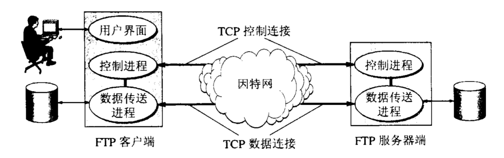

# FTP协议
FTP协议(`RFC 959`)是因特网上使用最广泛的文件传输协议，属于文件共享协议类，即**复制整个文件**，其特点是，若要存取一个文件就必须获得一个本地副本，
若要修改文件就只能对文件对副本进行修改，然后再将修改后对文件传回原节点。
## 概述
- `FTP`协议(`File Transfer Protocol`)是一种基于`TCP`协议的文件传输协议，它提供了交互式访问（提供文件类型、格式、权限控制），
适合在任何异构网络中进行文件传输。
- `FTP`基于`TCP`采用客户服务器方式提供可靠服务。
- `FTP`服务器进程由主进程和从属进程两部分组成，两部分进程并发的进行。主进程（端口`21`）接受客户端连接并启动从属进程。从属进程处理客户端请求且从属进程仍可能创建其他子进程。

## 工作模式
FTP支持2中工作模式，`Standard`模式和`Passive`模式，即主动模式和被动模式。

## Standard模式

- 在文件传输时，`FTP`客户端和服务端需要建立控制连接和数据连接两个`TCP`连接，而相应的服务端也会由有两个从属进程，控制进程和数据传送进程。
- 控制连接和控制进程并不负责传输文件数据，而是传送控制请求。
- 数据连接和数据进程用以文件数据的传输。

**工作流程**
1. 客户端通过控制进程发起请求，请求中携带用以建立数据连接对端口号，通过控制连接发送给服务端的控制进程（端口`21`）。
2. 服务端主进程收到请求，进行从属控制进程的建立，控制进程在收到客户端的文件传输请求后即创建数据传输进程通过数据连接端口`20`与客户端的提供的数据连接端口建立连接。
3. 数据进程在数据传输完毕后关闭数据连接并结束自身运行。

> 由于`FTP`使用了分离的控制连接，因此控制信息是带外（`out-of-band`）传送的。因使用了2个不同的端口，因此数据连接和控制连接不会发生混乱。

## Passive模式
控制连接和进程的创建方式和`Standard`类似，但在`Standard`模式中，是客户端发送一个新的数据连接端口到服务端，服务端与客户端连接。
`Passive`模式中，服务端控制进程收到数据传送请求后，随机打开一个高端端口（大于1024）并通知客户端在此端口上进行连接。
