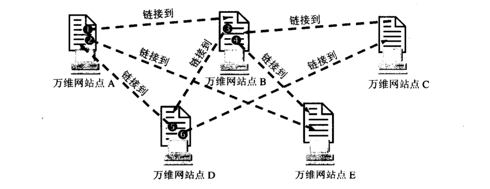
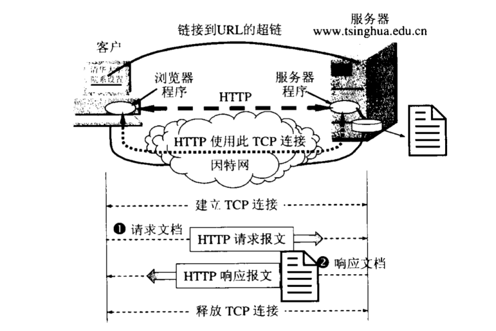
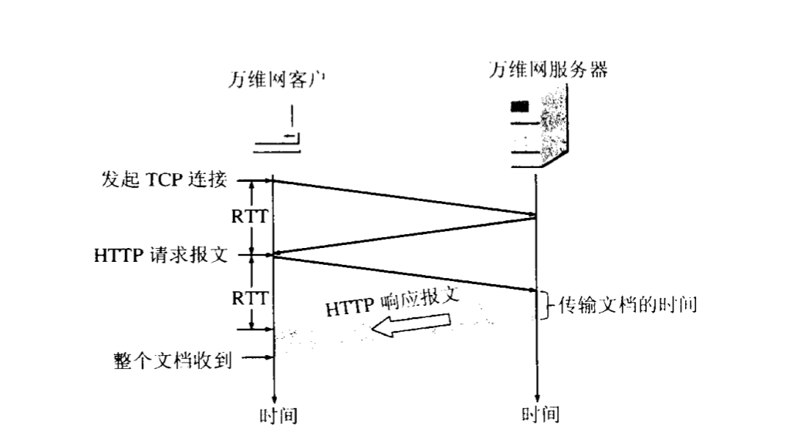

# HTTP协议

## 万维网 WWW
### 万维网的定义
**万维网WWW**（`World Wide Web`）并不是某种特殊对网络，而是大规模对联机信息储藏所，也称Web。
万维网用统一资源定位符URL（`Uniform Resource Locator`）标记万维网上对各种文档。

如上图，万维网是分布式结构，每个站点都提供了文档，而一个节点通过URL来链接到另一个节点。
万维网是一个分布式对超媒体（`hypermedia`）系统，它是对超文本（`hypertext`）系统对补充。
> 超文本：包含指向其他文本链接对文本，且仅仅包含文本。这是万维网对基础。
>
> 超媒体：超媒体可以包含不止包含文档，如图形、图像、声音、动画甚至是活动视频。

### 万维网的工作方式
1. 分布式结构，即大量的信息存储在各个节点上，每个主机独立的管理，
而对节点上对文档对增删改查都不可能通知到其他成千上万的节点进行`URL`的更新，所以万维网上文档之间的`URL`就会经常不一致。
2. 以**客户服务器**方式工作，客户端为浏览器，服务端为文档所在节点上的服务器程序。
3. 服务端发送请求，服务端则返回客户端所需的万维网文档。客户程序显示的万维网文档成为**页面**（`page`)。
4. 使用URL和HTTP（超文本传输协议`HyperText Transfer Protocol`）协议。
5. 页面的编写使用超文本标记语言HTML（HyperText Markup Language)。

> URL：相当于文件名在网络中的扩展，即在网络上访问文件的指针。 
>格式： `<协议>://<主机>:<端口>/<路径>`。

## HTTP协议
HTTP协议的号默认端口号为`80`，是一个使用`TCP`作为传输成协议的面向事务（`transaction-oriented`）的应用层协议。它是实现可靠的交换文件的基础（文本、声音、图像等）。

 

### HTTP协议的工作方式
**HTTP协议**规定客户与服务器之间的交互使用由`ASCII码串`构成的一个请求和一个响应组成。其报文通常由`TCP`链接传送。

**工作流程（基于`HTTP/1.0`)**

用户在浏览器输入一个`URL`，如（` http://domain.com/main/index.html `）之后
1. 浏览器分析`URL`。
2. 浏览器向DNS请求解析域名`domain.com`的IP地址。
3. `DNS`返回域名的`IP`地址。
4. 浏览器与与此`IP`地址的服务器建立`TCP`连接。
5. 浏览器发出取文件指令消息。
6. 服务器返回文本到客户端浏览器。
7. 释放`TCP`连接。
8. 浏览器显示返回的文本。

### HTTP协议的特性
1. **HTTP协议**使用了`TCP`做为传输层连接，但`HTTP`本身是无状态的。即用户的相同访问返回的结果相同，
服务器无法记住此用户访问过此页面，正因为如此，服务器更容易支持大量并发请求。
2. `HTTP`在建立`TCP`连接三次握手中的第三次握手就把请求报文发送给服务器。

