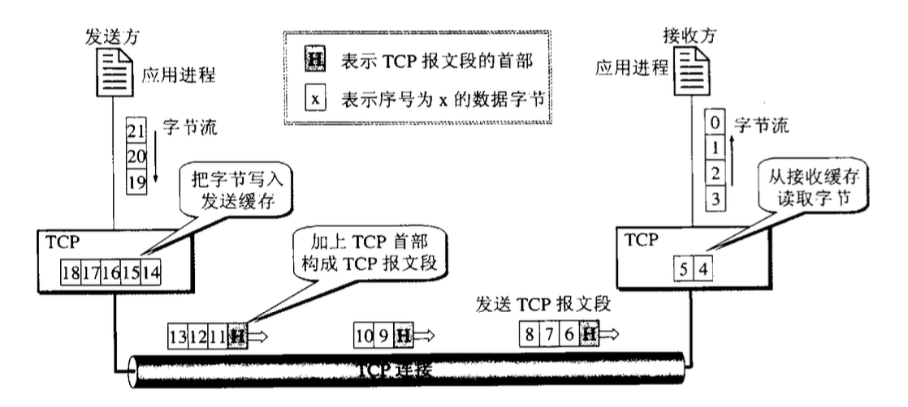

# TCP协议

**TCP协议**（Transmission Control Protocol）传输层的协议之一，和UDP协议一起最为运输层最重要的两种协议，
TCP协议是一种面向连接的协议，即在传输数据之前会先建立一个连接。

## 概述
1. TCP协议提供面向连接的服务，在传送数据之前需要先建立一个连接，传输完成之后需要释放连接。
2. TCP协议不提供广播或者多播。
3. 因提供可靠的服务，所以增加来许多操作，比如报文确认，流量控制，计时器和连接管理等。这使得每个协议数据单元更大，并且会更多等使用计算资源。

## 特点
1. 面向连接。
> 通信过程：建立连接 -- 传输数据 -- 释放连接。
2. 提供可靠服务。无差错、不丢失、不重复、按序到达。
> 通过校验，流量控制，重传，确认确保可靠性。
3. 全双工通信，TCP连接两端都有接收缓存和发送缓存。
> 发送端应用层将数据放入发送缓存即可做其他事，接收端在合适的时候取出缓存中的数据。
4. 面向字节流。
> "流"指进程流出或者流入进程的字节序列。虽然进程与TCP一次交互一个数据块，但是TCP将其看作进程交下来的无结构字节流。

