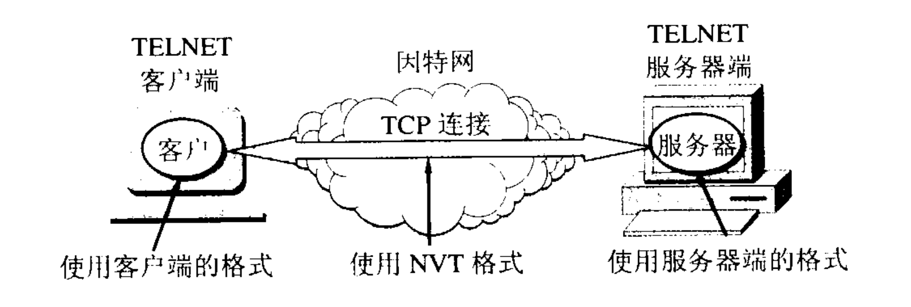

# TELNET协议
TELNET协议是一个简单的远程登录协议。可通过TELNET协议通过TCP连接登陆到远端的另一个主机上（使用主机名或IP地址）。

## 功能
`TELNET`协议能将用户的击键传输到远端主机上，同时也能将远端主机的输出通过`TCP`连接显示到本地主机屏幕上。
就像用户在操作本地主机一样，因此`TELNET`协议又称**终端仿真协议**。

## 如何工作
使用客户服务器方式，和`FTP`类似，服务器也分为主进程和从属进程。主进程等待新的请求，从属进程处理每一个连接。

## 操作系统差异
- TELNET能够适应不同操作系统之间的差异性。比如换行符`LF、CR、CRLF`等。
- TELNET定义了数据和命令应该怎样通过因特网，这些定义为**网络虚拟终端NVT**（Network Virtual Terminal），
- 客户端将请求的数据和命令转换成NVT格式，而服务端在响应时也将数据转换成NVT格式，客户端再将NVT格式的数据转换成所需的格式。

